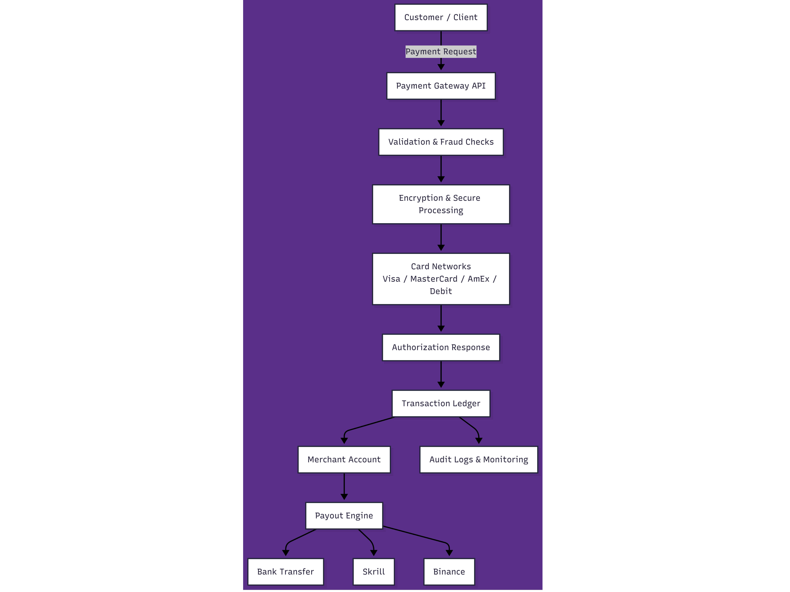

# Custom 2D Payment Gateway Backend with Multi-Method Payouts – FastAPI & Python

## Project Overview

A **backend-first, modular payment gateway** that simulates **2D card payments** (Visa, MasterCard, AmEx) with **debit & credit support**, internal **ledger tracking**, and multiple **payout mechanisms** including bank transfers, Skrill, and Binance-style crypto payouts. Built using **Python, FastAPI, and PostgreSQL**, this project demonstrates **production-ready backend architecture**, **event-driven transaction flows**, and **strong security controls** suitable for **senior backend/FinTech portfolios**.

This system is designed as a **pre-Stripe era custom payment gateway**, showing realistic transaction flows, merchant authentication, fraud prevention, and ledger management.

---

## Architecture & Flow



---

## Flow Highlights:

1. Merchant registers → receives **API keys** .
2. Client sends payment request → **HMAC-signed** .
3. Gateway validates, runs fraud checks, creates **PENDING transaction** .
4. Transaction moves through **INITIATED → AUTHORIZED → CAPTURED / FAILED** .
5. Internal ledger updates balances & fees.
6. Merchants request payouts → batch processed to Bank / Skrill / Binance.
7. Admin can audit, freeze merchants, or approve payouts.

---

## Tech Stack

- **Backend / API** : Python, FastAPI, SQLAlchemy, PostgreSQL
- **Security** : HMAC signatures, API key auth, IP whitelisting, card masking
- **Queue / Background Jobs** : Simulated for settlement & payout processing
- **Logging** : Structured transaction & security logs
- **Client Example** : Python requests HMAC signing demo
- **Deployment** : Docker-ready, environment variables for secrets

---

## Key Features

- Full **2D card simulation** (Visa, MasterCard, AmEx)
- **Merchant registration & API key management**
- **Transaction lifecycle** : INITIATED → AUTHORIZED → CAPTURED / FAILED / REFUNDED
- **Fraud controls** : velocity, amount thresholds, IP restrictions
- **Internal ledger** : double-entry style, platform fees, settlement-ready balances
- **Payout engine** : Bank, Skrill, Binance, batch processing
- **Admin panel** : audit logs, merchant freeze, payout approval
- **HMAC request signing** , replay protection, timestamp & nonce validation

---

## API Example

### Create Transaction

```bash
curl -X POST "http://127.0.0.1:8000/v1/transactions/" \
 -H "accept: application/json" \
 -H "Content-Type: application/json" \
 -H "X-Public-Key: <MERCHANT_PUBLIC_KEY>" \
 -d '{
      "card_number": "4111111111111111",
      "amount": 100.50,
      "currency": "USD"
 }'
```

Sample response:

```json
{
  "id": "3fa85f64-5717-4562-b3fc-2c963f66afa6",
  "merchant_id": "3fa85f64-5717-4562-b3fc-2c963f66afa6",
  "card_number_masked": "XXXX-XXXX-XXXX-1111",
  "amount": 100.5,
  "currency": "USD",
  "status": "AUTHORIZED",
  "created_at": "2026-01-13T15:13:12.332Z",
  "updated_at": "2026-01-13T15:13:12.332Z"
}
```

---

## Local Setup

1. Clone the repo:

```bash
git clone https://github.com/abq2904/custom-2d-payment-gateway-backend.git
cd custom-2d-payment-gateway-backend
```

2. Create virtual environment & install dependencies:

```bash
python -m venv .venv
.venv\Scripts\activate  # Windows
pip install -r requirements.txt
```

3. Run the API locally:

```bash
python -m uvicorn app.main:app --reload
```

4. Open Swagger UI for testing: `http://127.0.0.1:8000/docs`
5. (Optional) Run merchant client HMAC test:

```bash
python client/secure_test_client.py
```

---

## Screenshots & Examples

1. **Merchant Dashboard**
   `merchant_dashboard.png` — View registered merchant details and API key.
2. **API Credentials**
   `api_credentials.png` — Merchant public & secret key generation.
3. **Unauthorized Transaction**
   `unauthorized_transaction.png` — Invalid API key rejected.
4. **Successful Transaction**
   `transaction_success.png` — Transaction lifecycle: INITIATED → AUTHORIZED.
5. **Failed Transaction**
   `transaction_failed.png` — Transaction rejected due to amount / fraud rule.

---

## License

MIT License

---

## Keywords

Payment Gateway, 2D Cards, FastAPI, Python, PostgreSQL, Ledger, Fraud Prevention, Merchant API, Payout Engine, Secure HMAC, Backend Portfolio, FinTech, Event-Driven Transactions, Admin Panel, SaaS Payments
